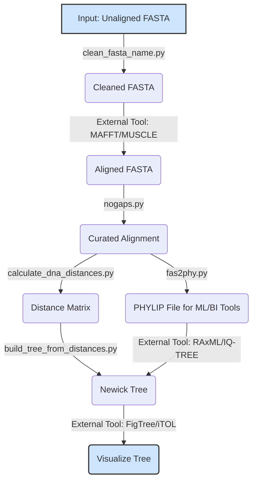

<a name="top"></a>
# EvolCat-Python: A Python Suite for Evolutionary and Comparative Genomics


[](https://www.preprints.org/manuscript/202505.2059/v1)

EvolCat-Python is a powerful suite of command-line tools that simplifies and accelerates common tasks in evolutionary biology and comparative genomics. Converted from a battle-tested collection of Perl scripts, this project leverages the power of Biopython and other modern libraries to provide a robust, user-friendly toolkit for researchers.

## Key Features

EvolCat-Python streamlines complex bioinformatics tasks. With this suite, you can:

*   🧬 **Format Conversion:** Effortlessly convert between common formats like GenBank, FASTA, and PHYLIP (`gb2fasta.py`, `fas2phy.py`).
*   🚀 **BLAST Result Processing:** Parse raw BLAST output into clean, usable tables for downstream analysis (`parse_blast_text.py`, `blast_to_table.py`).
*   🌳 **Phylogenetic Pipeline Assistance:** Prepare sequences, curate alignments, and calculate distance matrices for external tree-building software (`nogaps.py`, `calculate_k2p.py`).
*   🔬 **Sequence Analysis & Extraction:** Extract CDS regions from GenBank files, translate them, and analyze specific nucleotide positions (`extract_cds_region.py`, `gbCDS.py`).
*   🦠 **Virus Genomics & Protein Analysis:** Utilize dedicated pipelines and guides for viral analysis, including a full SARS-CoV-2 lineage classification pipeline, protein language model analysis, and evolutionary data retrieval pipelines. See `pipelines/README.md` for details.
*   🛠️ **Powerful Wrappers:** Simplify interaction with external tools like PAML and perform basic filtering on VCF files.

## Example Workflow: Phylogenetic Analysis

Visually understand how EvolCat-Python scripts work together with external tools to build a phylogenetic tree.



**User Responsibility:**
The scripts and library components provided here are for research and informational purposes. Users are responsible for validating the results obtained using this software, interpreting them correctly, and ensuring they are appropriate for their specific application. The original authors and the converters of this code disclaim any liability for its use or misuse. It is recommended to test the tools with known datasets and compare results with other established bioinformatics software where appropriate. Users may need to adapt or modify the code to suit their specific research needs and computational environment.

## Table of Contents

1.  [Overview](#overview)
2.  [Dependencies](#dependencies)
3.  [Installation](#installation)
4.  [General Script Usage](#general-script-usage)
5.  [NCBI Tools](#ncbi-tools)
6.  [Relationship with Biopython](#relationship-with-biopython-and-scope-of-provided-scripts)
7.  [Workflow Examples](#workflow-examples)
8.  [Virus Genomics, Diversity, and Analysis](#virus-genomics-diversity-and-analysis)
9.  [Technical Guides](#technical-guides)
10. [Detailed Script Usage](#detailed-script-usage)
11. [Development and Contributions](#development-and-contributions)
12. [Citation](#citation)


[Back to Top](#top)

## Overview

The library is organized into:

*   `pylib/utils/`: Contains core utility modules for tasks like sequence parsing.
*   `pylib/scripts/`: Contains executable Python scripts that replicate and extend the functionality of original bioinformatics command-line tools. Many of these scripts depend on the `pylib/utils/` core utility modules. The scripts are designed to find these modules by default when EvolCat-Python is structured with `pylib/utils/` as a subdirectory. Some scripts may have their own detailed `README.md` files within this directory (e.g., `extract_cds_region.py`).
    *   `pylib/scripts/ncbi/`: Contains tools specifically for interacting with NCBI.
    *   `pylib/scripts/paml_tools/`: Contains tools specifically for PAML genomics analysis.


[Back to Top](#top)

## Dependencies

The primary dependencies for this library are listed in the `requirements.txt` file and `setup.py`. Key dependencies include:

*   Python 3.7 or higher (Python 3.10.0 specifically tested with WSL setup below)
*   Biopython
*   Matplotlib
*   Requests (specifically for the NCBI tools module)
*   (Other specific dependencies might be required by individual scripts or future additions. External phylogenetic software like ClustalW/MUSCLE/MAFFT, RAxML/IQ-TREE/PhyML will be needed for parts of the phylogenetic workflow).

Please refer to `requirements.txt` or `setup.py` for a complete list of dependencies and their versions.


[Back to Top](#top)

## Installation

### General Python Environment Setup
It is highly recommended to use a virtual environment (e.g., `venv` or `conda`) to manage dependencies for this project.

```bash
# Using venv (standard Python)
python3 -m venv evolcat_env
source evolcat_env/bin/activate # On Unix/macOS
# evolcat_env\Scripts\activate # On Windows

# Or using conda
# conda create -n evolcat_env python=3.10
# conda activate evolcat_env
```
Once your environment is activated, you can install dependencies.


[Back to Top](#top)

### Installing EvolCat-Python

1.  **Clone the repository:**
    ```bash
    git clone https://github.com/bob-friedman/EvolCat-Python.git
    cd EvolCat-Python
    ```
2.  **Install the package and its dependencies:**
    If you are installing the package from the root directory of this repository (i.e., after cloning and `cd EvolCat-Python`), you can install it along with all dependencies by running:
    ```bash
    pip install .
    ```
    This command reads `setup.py` and `requirements.txt` to install EvolCat-Python and its listed dependencies like Biopython, Matplotlib, and Requests.


[Back to Top](#top)

### Access in a Windows OS with WSL (Windows Subsystem for Linux)
<details>
<summary><b>Click here for detailed WSL setup instructions</b></summary>

To access these scripts from a Linux environment in supported versions of Windows, the first step is to verify the installation of WSL. The subsequent steps involve using "pip" to manage packages in Python. However, the default Python version shipped with some Linux distributions (like Ubuntu) available via WSL might have compatibility issues with `pip`'s ability to install packages in user-writable locations or may lead to conflicts with system-managed Python packages.

To work around such issues and manage Python versions more effectively within WSL, `pyenv` can be used. The following steps describe a third-party procedure that has been tested on one system. **These steps modify your shell environment and install software; proceed with caution and understand what each command does.**

In your Ubuntu/WSL shell:

1.  **Install build dependencies for `pyenv` and Python:**
    ```bash
    sudo apt update
    sudo apt install -y gcc make build-essential libssl-dev libffi-dev zlib1g-dev libbz2-dev libreadline-dev libsqlite3-dev wget curl llvm libncurses5-dev xz-utils tk-dev libxml2-dev libxmlsec1-dev liblzma-dev
    ```
2.  **Install `pyenv`:**
    ```bash
    curl https://pyenv.run | bash
    ```
3.  **Configure your shell environment for `pyenv`:**
    Add the following lines to your `~/.bashrc` file (or `~/.zshrc` if using Zsh):
    ```bash
    export PYENV_ROOT="$HOME/.pyenv"
    command -v pyenv >/dev/null || export PATH="$PYENV_ROOT/bin:$PATH"
    eval "$(pyenv init -)"
    ```
    Then, apply the changes by sourcing your shell configuration file (e.g., `source ~/.bashrc`) or by opening a new terminal.

4.  **Install a specific Python version using `pyenv`:**
    (e.g., Python 3.10.0, which is relatively recent as of May 2025 context from original notes)
    ```bash
    pyenv install 3.10.0
    ```
5.  **Set the Python version for your environment:**
    You can set it globally or locally for the current project directory.
    ```bash
    pyenv global 3.10.0  # Set 3.10.0 as the default version of Python for your user
    # OR
    # pyenv local 3.10.0   # Set 3.10.0 as the version when running within the current folder
    ```
    After setting the Python version with `pyenv`, `python3` and `pip` commands will use this version. You can then proceed with cloning the EvolCat-Python repository and installing it using `pip install .` as described above within your WSL environment.
</details>

[Back to Top](#top)

## General Script Usage

*   All executable scripts are located in the `pylib/scripts/` directory (and subdirectories like `pylib/scripts/ncbi/`).
*   If you have installed the package using `pip install .`, some scripts might be available directly on your PATH (depending on `setup.py` configuration). Otherwise, run scripts from the command line using `python3 path/to/script.py [arguments]`.
    For example, from the root `EvolCat-Python` directory:
    ```bash
    python3 pylib/scripts/gb2fasta.py my_input.gb
    ```
*   Use the `-h` or `--help` flag with any script to see its specific command-line options and a brief description.
    ```bash
    python3 pylib/scripts/gb2fasta.py -h
    ```


[Back to Top](#top)

## NCBI Tools

This library includes specific tools for interacting with NCBI services. These are located in `pylib/scripts/ncbi/` and include:

*   `blast_ncbi_seq_def_py` (likely `pylib/scripts/ncbi/blast_ncbi_seq_def.py`): Retrieves sequence definitions from NCBI based on BLAST results.
*   `query_ncbi_gi_py` (likely `pylib/scripts/ncbi/query_ncbi_gi.py`): Queries NCBI using GenInfo Identifiers (GIs) to retrieve sequence data.

These tools require the `requests` library, which will be installed if you use `pip install .`. For more detailed information on these specific NCBI tools, please see `pylib/scripts/ncbi/README.md` (if present) or use the `--help` flag with the scripts themselves.


[Back to Top](#top)

## Relationship with Biopython and Scope of Provided Scripts

EvolCat-Python is built upon and requires [Biopython](https://biopython.org) as a core dependency. Many scripts in this suite act as convenient command-line wrappers or implement common workflows by intelligently utilizing Biopython's underlying capabilities. This approach allows for rapid execution of specific, often complex, tasks directly from the command line.

While EvolCat-Python offers these targeted solutions, Biopython itself is a comprehensive library with vast functionalities. For highly advanced or customized analyses, users are encouraged to leverage Biopython's modules directly. Our scripts provide useful functionalities in areas like **pairwise alignment**, **MSA analysis**, **phylogenetics**, **motif scanning**, and **dN/dS estimation**, while Biopython offers significantly more depth for those wishing to delve deeper.

Users familiar with Python programming can readily combine the convenience of EvolCat-Python scripts with the extensive library functionalities of Biopython to build sophisticated and efficient bioinformatics pipelines.


[Back to Top](#top)

## Workflow Examples

This section outlines general workflows, highlighting where EvolCat-Python scripts can be utilized.

<details>
<summary><b>Workflow A: Building a Local Sequence Database from NCBI</b></summary>

This workflow describes creating a local sequence database using NCBI resources.

#### Step 1: Identifying and Retrieving Initial Sequences
Often, building a local database starts with a set of query sequences or keywords to find related entries in NCBI.

*   **Using NCBI Website or E-utilities:** Perform initial searches directly on the NCBI website (e.g., BLAST, Entrez search) or use E-utilities (e.g., `esearch`, `efetch`).
*   **EvolCat-Python for BLAST output processing:** If you run a BLAST search and get text output:
    *   `pylib/scripts/parse_blast_text.py`: Parses standard text BLAST output.
    *   `pylib/scripts/blast_to_table.py`: Converts BLAST text output to a tab-delimited table.
    *   `pylib/scripts/find_blast_top_pairs.py`: Helps identify top-scoring unique pairs.
    From these results, extract accession numbers for your local database.

#### Step 2: Fetching Full Records for Retrieved IDs
Once you have a list of NCBI accession numbers, download their full records.
```bash
# Example using Entrez Direct (assuming you have a file of accessions: accs.txt)
# efetch -db nucleotide -format gb -input accs.txt > my_sequences.gb
```

#### Step 3: Converting Formats
*   **EvolCat-Python `gb2fasta.py`:** Converts GenBank files to FASTA.
    ```bash
    python3 pylib/scripts/gb2fasta.py my_sequences.gb > my_sequences.fasta
    ```

#### Step 4: Extracting Relevant Information
*   **EvolCat-Python `gbCDS.py`:** Extracts CDS information from GenBank files.
*   **EvolCat-Python `translate_seq.py`:** Translates nucleotide FASTA files to protein.

#### Step 5: Cleaning and Standardizing Sequence Data
*   **EvolCat-Python `clean_fasta_name.py`:** Standardizes FASTA headers.
*   **EvolCat-Python `nogaps.py`:** Removes gap columns from alignments.

#### Step 6: Merging and Organizing Your Local Database
*   **EvolCat-Python `merge_fastas.py`:** Merges multiple FASTA files.
</details>

<details>
<summary><b>Workflow B: Performing a Phylogenetic Tree Analysis</b></summary>

This workflow outlines the steps involved in phylogenetic analysis, indicating where EvolCat-Python scripts and external tools are typically used.

#### Step 1: Sequence Preparation and Alignment
*   **Sequence Retrieval & Formatting:** Use scripts like `gb2fasta.py`, `clean_fasta_name.py`, or `merge_fastas.py` as needed.
*   **Multiple Sequence Alignment (MSA) (External Tools):** Use external software like Clustal Omega, MUSCLE, or MAFFT.
    ```bash
    # Example using an external MSA tool (conceptual)
    # muscle -in unaligned_sequences.fasta -out aligned_sequences.afa
    ```

#### Step 2: Alignment Curation and Basic Analysis
*   **EvolCat-Python `nogaps.py`:** Removes columns containing mostly gaps or ambiguous characters.
*   **EvolCat-Python `analyze_msa.py`:** Calculate consensus, get alignment stats.
*   **Manual Inspection:** Use alignment viewers (e.g., Jalview, AliView).

#### Step 3: Phylogenetic Inference
*   **Format Conversion for Tree Builders:**
    *   **EvolCat-Python `fas2phy.py`:** Converts aligned FASTA to PHYLIP sequential format.
*   **Calculating Distance Matrices (Optional):**
    *   **EvolCat-Python `calculate_dna_distances.py` or `calculate_k2p.py`:** Produce tables of pairwise distances.
*   **Building a Tree from Distances (EvolCat-Python):**
    *   Use `pylib/scripts/build_tree_from_distances.py` to construct a tree using Neighbor-Joining (NJ) or UPGMA.
        ```bash
        # Example assuming my_distances.phy is your PHYLIP distance matrix
        python3 pylib/scripts/build_tree_from_distances.py my_distances.phy --method nj --outfile my_tree.nwk
        ```
*   **Tree Building (Alternative External Tools):**
    *   For Maximum Likelihood (ML) or Bayesian Inference (BI), use tools like RAxML, IQ-TREE, or MrBayes.

#### Step 4: Tree Visualization and Basic Manipulation
*   **Visualization:** Use external tools like FigTree, iTOL, or Dendroscope, or Python libraries like Biopython's `Bio.Phylo`.
</details>

<details>
<summary><b>Workflow C: Performing a Standard Pairwise Sequence Alignment with Biopython</b></summary>

While EvolCat-Python provides `approximate_string_match.py` for edit distance, standard biological alignments with scoring matrices are best performed with Biopython directly.

**Objective:** To find the optimal alignment(s) between two sequences.

**Steps:**

1.  **Prepare Input Sequences:** Place two sequences in separate FASTA files (e.g., `seq1.fasta`, `seq2.fasta`).
2.  **Create a Python Script for Alignment:** Create `run_pairwise_alignment.py` to use Biopython's `Bio.Align.PairwiseAligner`.

    ```python
    from Bio import SeqIO
    from Bio import Align

    # --- 1. Load your sequences ---
    seq_record1 = SeqIO.read("seq1.fasta", "fasta")
    seq_record2 = SeqIO.read("seq2.fasta", "fasta")
    
    # --- 2. Initialize and Configure the Aligner ---
    aligner = Align.PairwiseAligner()
    aligner.mode = 'global'  # Or 'local'
    aligner.match_score = 2
    aligner.mismatch_score = -1
    aligner.open_gap_score = -2.5
    aligner.extend_gap_score = -1
    
    # --- 3. Perform the Alignment ---
    print(f"Aligning {seq_record1.id} and {seq_record2.id}...")
    alignments = aligner.align(seq_record1.seq, seq_record2.seq)
    
    # --- 4. Print Results ---
    print(f"Number of optimal alignments: {len(alignments)}")
    print(f"Alignment score: {alignments.score}")
    print(alignments[0]) # Print the first optimal alignment
    ```

3.  **Run the Python Script:**
    ```bash
    python3 run_pairwise_alignment.py
    ```
</details>

<details>
<summary><b>Workflow D: Basic Motif Scanning</b></summary>

Identifying known motifs within a set of sequences is a common requirement.

*   **Prepare Input Sequences:** Ensure your sequences are in a FASTA file (e.g., `promoter_regions.fasta`).
*   **Scan for Motif:** Use **EvolCat-Python's `pylib/scripts/scan_sequences_for_motif.py`**.
    ```bash
    # Example: Scan for the motif 'TGACGTCA' in promoter_regions.fasta
    python3 pylib/scripts/scan_sequences_for_motif.py promoter_regions.fasta --motif TGACGTCA --output_report found_motifs.tsv
    ```
    The script will output a tab-delimited file listing each occurrence.
</details>

### VCF File Analysis and Filtering
[Background on VCF Analysis](pylib/scripts/vcf_analysis_tools/README.md) and [`analyze_vcf.py` usage](docs/USAGE.md#pylibscriptsanalyze_vcfpy).

### Extracting and Analyzing CDS Regions
[extract_cds_region.py README](pylib/scripts/README.md)

### SARS-CoV-2 Lineage Classification Pipeline
[Documentation for the SARS-CoV-2 Lineage Classification Pipeline](./pipelines/sars_cov2_lineage_classification/README.md)


[Back to Top](#top)

## Technical Guides <a name="technical-guides"></a>
*   [Guide to Accessing MHC Sequence Databases](guides/mhc-database-guide.md)
*   [Guide to Interpreting Phylogenetic Trees with Python](guides/phylogenetic-tree-interpretation.md)
*   [Report on the Computational Prediction of Viral Evolution](guides/computational_prediction_of_viral_evolution.md)

[Back to Top](#top)

## Virus Genomics, Diversity, and Analysis <a name="virus-genomics-diversity-and-analysis"></a>

[Guide to Virus Genomics, Diversity, and Analysis](guides/virus_genomics_guide.md)


[Back to Top](#top)

## Detailed Script Usage

For detailed command-line options and examples for each script, please refer to:
`docs/USAGE.md`

You can also use the `-h` or `--help` flag with any script:
```bash
python3 pylib/scripts/script_name.py -h
```


[Back to Top](#top)

## Development and Contributions

This library was primarily converted from its original Perl source using AI-assisted tooling (Model: Gemini Pro, Agent: Jules AI). The process involved analyzing original Perl scripts, translating logic to Python, structuring the code into a package, creating command-line interfaces, and developing initial documentation.

Human oversight and review are crucial for ensuring the accuracy and robustness of the converted code. This library is currently under development. Contributions, bug reports, and feature requests are welcome via GitHub Issues and Pull Requests.

[Back to Top](#top)

## Citation <a name="citation"></a>

If you use EvolCat-Python in your research or find the repository useful, please cite the following paper:
> Friedman, R. EvolCat-Python: A Python Suite for Evolutionary and Comparative Genomics. Preprints 2025, 2025052059. https://www.preprints.org/manuscript/202505.2059/v1

[Back to Top](#top)
