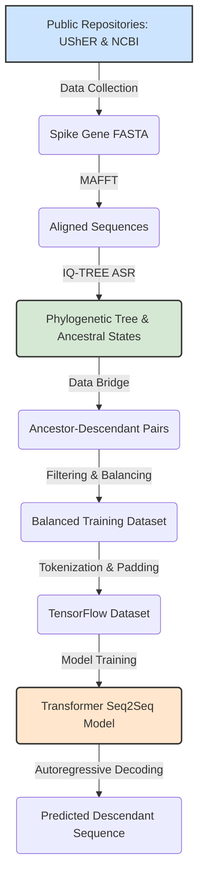

<a name="top"></a>

# Guided Pipeline: Ancestral Sequence-Based Viral Evolution Modeling


**Objective:** This notebook provides a complete, end-to-end pipeline for training a Transformer-based sequence-to-sequence model on viral evolution data. It demonstrates the process of data acquisition, ancestral state reconstruction, data preparation, model training, and inference, while documenting the inherent computational and biological limitations encountered when using standard cloud-based hardware.

⚠️ **IMPORTANT USAGE NOTE**
These are complex pipelines of code. The parsing of sequence data for ancestral reconstructions and its association with sequence names is problematic without extensive verification. Therefore, it is strictly necessary to add additional logging and validation steps if either of these pipelines are adapted for production studies.

**Methodology:** The pipeline utilizes data from UShER and NCBI. It employs IQ-TREE for phylogenetic inference and Ancestral State Reconstruction (ASR) to generate ancestor-descendant sequence pairs. A Transformer model, implemented in TensorFlow/Keras, is then trained on this data to learn mutational patterns. The guide is structured to be executed sequentially in a non-Google Colab environment and requires adaptation to your development environment (as Colab shell support has limitations).

## Pipeline Architecture Overview

Visually understand how data flows from public repositories through phylogenetic reconstruction and into the deep learning model.



## Table of Contents

1.  [Central Configuration](#part-0)
2.  [Environment Setup](#part-1)
3.  [Install Dependencies & Mount Drive](#part-2)
4.  [Data Collection & Gene Retrieval](#part-3)
5.  [Phylogenetics and Ancestral State Reconstruction (ASR)](#part-4)
6.  [Data Bridge - Parsing ASR Output](#part-5)
7.  [Data Filtering and Balancing](#part-6)
8.  [Transformer Model - Setup & Data Preparation](#part-7)
9.  [Transformer Model - Definition & Training](#part-8)
10. [Inference and Prediction](#part-9)
11. [Lessons Learned & Alternative Strategies](#lessons-learned)
12. [Discussion and Future Directions](#part-10)
13. [References](#references)

<a name="part-0"></a>

## ⚙️ Part 0: Central Configuration

This block contains all key parameters for the pipeline. The current parameters are set to a "survival mode" configuration designed to ensure successful completion within the resource limits of a standard, free Google Colab instance.

```python
# --- Pipeline Configuration ---
# Bioinformatics Parameters
CLADE_NAME = "XBB.2.3"             # The specific clade to analyze from UShER
SAMPLE_SIZE = 300                  # Number of sequences to sample for the demo run

# Keras Transformer Model Parameters
# NOTE: These are severely constrained to ensure completion on a free Colab instance.
MAX_SEQ_LENGTH = 1024              # Max sequence length (truncates longer sequences)
BATCH_SIZE = 8                     # Number of pairs per training batch
EPOCHS = 10                        # Number of training epochs
EMBED_DIM = 64                     # Embedding dimension for each token
NUM_HEADS = 4                      # Number of attention heads
FF_DIM = 256                       # Hidden layer size in the feed-forward network
NUM_ENCODER_LAYERS = 2             # Number of stacked encoder layers
NUM_DECODER_LAYERS = 2             # Number of stacked decoder layers
DROPOUT_RATE = 0.1

# --- File Naming ---
IQTREE_PREFIX = f"spike_aligned_{SAMPLE_SIZE}"
FINAL_TRAINING_FILE = "final_training_pairs.tsv"
MODEL_CHECKPOINT_FILE = "viral_transformer_checkpoint.weights.h5"
```

[Back to Top](#top)

<a name="part-1"></a>

## 🛠️ Part 1: Environment Setup

**Objective:** Install the conda package manager into the Colab environment.

**Methodology:** The condacolab library is used. Note: The kernel will automatically restart after this cell completes. This is expected. Manually execute the subsequent cells after the restart.

```python
!pip install -q condacolab
import condacolab
condacolab.install()
```

[Back to Top](#top)

<a name="part-2"></a>

## 📂 Part 2: Install Dependencies & Mount Drive

**Objective:** Mount Google Drive for persistent storage and install necessary bioinformatics software.

**Methodology:** Google Drive is mounted at /content/drive. The working directory is changed to a user-specified project folder. The conda package manager is used to install mafft, iqtree, entrez-direct, and bcftools.

```python
import os
from google.colab import drive

# Mount Google Drive
drive.mount('/content/drive')

# IMPORTANT: Change this to a dedicated project directory in your Google Drive.
os.chdir('/content/drive/MyDrive') # Using root of MyDrive for this example
print(f"Current working directory: {os.getcwd()}")

# Install all necessary bioinformatics tools into the Conda environment
print("\nInstalling bioinformatics tools with Conda...")
!conda install -y -c bioconda -c conda-forge mafft iqtree entrez-direct bcftools

# Verify key installations
print("\nVerifying installations...")
!mafft --version
!iqtree --version
!bcftools --version
```

[Back to Top](#top)

<a name="part-3"></a>

## 🧬 Part 3: Data Collection & Gene Retrieval

**Objective:** Acquire raw data and isolate the target gene sequences for analysis.

**Methodology:** A helper function ensures idempotent file generation. The UShER public protobuf and metadata files are downloaded. matUtils extracts a VCF for the specified clade. bcftools and pandas are used to create a list of GenBank accessions. A robust shell script then retrieves the Spike (S) gene sequences for these accessions in batches from NCBI.

```python
import os
import pandas as pd
import gc
import sys

def ensure_file_exists(file_path, command_to_run):
    if os.path.isfile(file_path): return
    print(f"Generating '{os.path.basename(file_path)}'...")
    os.system(command_to_run)
    if not os.path.isfile(file_path):
        print(f"FATAL: Failed to create '{os.path.basename(file_path)}'. Halting.")
        sys.exit(1)

BASE_PATH = os.getcwd()
PB_FILE = os.path.join(BASE_PATH, "public-latest.all.masked.pb")
METADATA_FILE_FULL = os.path.join(BASE_PATH, "public-latest.metadata.tsv")
CLADE_VCF_FILE = os.path.join(BASE_PATH, f"{CLADE_NAME}.vcf")
ACCESSION_FILE = os.path.join(BASE_PATH, f"{CLADE_NAME}_accessions.txt")
GENE_S_FASTA = os.path.join(BASE_PATH, "s_gene_sequences.fasta")

ensure_file_exists(PB_FILE, "wget -q --show-progress http://hgdownload.soe.ucsc.edu/goldenPath/wuhCor1/UShER_SARS-CoV-2/public-latest.all.masked.pb.gz && gunzip -f public-latest.all.masked.pb.gz")
ensure_file_exists(METADATA_FILE_FULL, "wget -q --show-progress http://hgdownload.soe.ucsc.edu/goldenPath/wuhCor1/UShER_SARS-CoV-2/public-latest.metadata.tsv.gz && gunzip -f public-latest.metadata.tsv.gz")
ensure_file_exists(CLADE_VCF_FILE, f"matUtils extract -i {PB_FILE} -c '{CLADE_NAME}' -v {CLADE_VCF_FILE}")

if not os.path.isfile(ACCESSION_FILE):
    !bcftools query -l {CLADE_VCF_FILE} > vcf_samples.txt
    with open("vcf_samples.txt", "r") as f: vcf_samples_set = set(line.strip() for line in f)
    df_meta = pd.read_csv(METADATA_FILE_FULL, sep='\t', usecols=['strain', 'genbank_accession'], dtype=str)
    clade_metadata_df = df_meta[df_meta['strain'].isin(vcf_samples_set)].dropna(subset=['genbank_accession'])
    accession_list = clade_metadata_df['genbank_accession'].unique()
    with open(ACCESSION_FILE, 'w') as f:
        for acc in accession_list:
            if acc: f.write(f"{acc}\n")
    del df_meta, clade_metadata_df, vcf_samples_set; gc.collect()

if not os.path.isfile(GENE_S_FASTA):
    ncbi_fetch_script = f"""
    #!/bin/bash
    ACCESSION_FILE="{ACCESSION_FILE}" GENE_S_FASTA="{GENE_S_FASTA}"
    BATCH_SIZE=100; TEMP_DIR=$(mktemp -d); trap 'rm -rf -- "$TEMP_DIR"' EXIT; rm -f "${{GENE_S_FASTA}}"
    split -l "${{BATCH_SIZE}}" "${{ACCESSION_FILE}}" "${{TEMP_DIR}}/batch_"
    for batch_file in ${{TEMP_DIR}}/batch_*; do
        id_list=$(paste -sd ',' "${{batch_file}}")
        curl -s -X POST "https://eutils.ncbi.nlm.nih.gov/entrez/eutils/efetch.fcgi" -d "db=nuccore" -d "rettype=fasta_cds_na" -d "retmode=text" -d "id=${{id_list}}" | awk -v p="[gene=S]" 'BEGIN{{RS=">";OFS=""}}NF>0{{h=substr($0,1,index($0,"\\n")-1);s=substr($0,index($0,"\\n")+1);gsub(/\\n/,"",s);if(index(h,p)){{print ">"h,"\\n"s}}}}' >> "${{GENE_S_FASTA}}"; sleep 1
    done
    """
    !bash -c '{ncbi_fetch_script}'
```

[Back to Top](#top)

<a name="part-4"></a>

## 🌳 Part 4: Phylogenetics and Ancestral State Reconstruction (ASR)

**Objective:** Generate the core dataset of (ancestor, descendant) pairs.

**Methodology:** A subsample of sequences is taken for computational tractability. Headers are simplified, and the sequences are aligned with MAFFT. IQ-TREE is then used to build a phylogenetic tree and infer the sequences of all ancestral nodes.

<details>
<summary><b>Technical Note: The "Breadth" Bottleneck (Number of Sequences)</b></summary>

Computational Limitation: Phylogenetic inference is an NP-hard problem. The number of possible unrooted trees for n sequences scales factorially (O((2n-5)!!)), making analysis of large datasets computationally intensive. Empirical Finding: Processing the full set of >5,000 sequences for the selected clade exceeded the resource limits of the execution environment. Subsampling to 300 sequences was required for the pipeline to complete.

Biological Limitation: Rapidly radiating clades, such as XBB.2.3, can exhibit low inter-sequence diversity. This may result in phylogenetic trees with branches of low statistical support, introducing uncertainty into the inferred ancestral states—a limitation inherent to the biological data itself, independent of hardware.
</details>

<details>
<summary><b>Technical Note: Caveats on Reconstructing Viral Origins</b></summary>

Deep Lineage Inference: Deeper and more ancient evolutionary relationships across a phylogenetic tree are not as tractable for reconstruction as more recent ones. The compounding effects of errors over evolutionary time lead to a high rate of error and low reliability for the construction of ancestral character states (Friedman, 2026).

Data Sampling and Methodology: Robust empirical analysis relies on robust molecular data sampling. A major source of sampling bias is the lack of data for ancient lineages (data sparsity). Therefore, it is necessary that any communication on the mechanisms of the natural world is grounded in empiricism and a reasonable level of skepticism toward novel conclusions (Friedman, 2026).
</details>

```python
SAMPLED_SEQS = f"spike_sampled_{SAMPLE_SIZE}.fas"
SIMPLIFIED_SEQS = f"spike_simplified_{SAMPLE_SIZE}.fas"
ALIGNED_SEQS = f"spike_aligned_{SAMPLE_SIZE}.fas"

if os.system('seqtk > /dev/null 2>&1') != 0:
    !sudo apt-get -qq update && sudo apt-get -qq install -y seqtk

ensure_file_exists(SAMPLED_SEQS, f"seqtk sample -s42 {GENE_S_FASTA} {SAMPLE_SIZE} > {SAMPLED_SEQS}")
ensure_file_exists(SIMPLIFIED_SEQS, f"awk '/^>/ {{print \">seq\" ++i; next}} {{print}}' {SAMPLED_SEQS} > {SIMPLIFIED_SEQS}")
ensure_file_exists(ALIGNED_SEQS, f"mafft --auto {SIMPLIFIED_SEQS} > {ALIGNED_SEQS}")
ensure_file_exists(f"{IQTREE_PREFIX}.state", f"iqtree -s {ALIGNED_SEQS} -m MFP -asr -pre {IQTREE_PREFIX} -nt AUTO -redo")
```

### Alternative: Dependency-Free Parsimony Reconstruction

For cases where external tools like IQ-TREE are not available, a standalone Python script `parsimony_reconstruction.py` (found in `pylib/scripts/`) can be used. It performs a two-pass Fitch parsimony reconstruction on branch-annotated Newick trees.

```bash
# Example usage of the standalone parsimony script
python pylib/scripts/parsimony_reconstruction.py usher_tree_with_mutations.txt --pairs
```

[Back to Top](#top)

<a name="part-5"></a>

## 🌉 Part 5: Data Bridge - Parsing ASR Output

**Objective:** Convert the tabular ASR output from IQ-TREE into a structured DataFrame of ancestor-descendant pairs.

**Methodology:** The .state file is read using pandas. Sequences are reconstructed by grouping the table by node name. The .treefile is parsed with ete3, and the tree topology is traversed to create pairs.

```python
!pip install -q ete3 pandas
from ete3 import Tree
import pandas as pd

TREE_FILE = f"{IQTREE_PREFIX}.treefile"
STATE_FILE = f"{IQTREE_PREFIX}.state"
OUTPUT_PAIRS_FILE = "ancestor_descendant_pairs.tsv"

state_df = pd.read_csv(STATE_FILE, sep='\t', comment='#')
sequences = state_df.sort_values('Site').groupby('Node')['State'].apply(''.join).to_dict()
t = Tree(TREE_FILE, format=1)
pairs = []
for node in t.traverse("preorder"):
    if not node.is_root():
        ancestor_name, descendant_name = node.up.name, node.name
        if ancestor_name in sequences and descendant_name in sequences:
            pairs.append({"ancestor_seq": sequences[ancestor_name], "descendant_seq": sequences[descendant_name]})

df_pairs = pd.DataFrame(pairs)
df_pairs.to_csv(OUTPUT_PAIRS_FILE, sep='\t', index=False)
```

[Back to Top](#top)

<a name="part-6"></a>

## ⚖️ Part 6: Data Filtering and Balancing

**Objective:** Create a balanced training set to prevent model bias towards stasis.

**Methodology:** The generated pairs are separated into "mutated" and "identical" sets. A random subsample of the "identical" set, equal in size to the "mutated" set, is taken. These are then combined and shuffled to form the final training data.

```python
df_pairs = pd.read_csv(OUTPUT_PAIRS_FILE, sep='\t')
is_mutated = df_pairs['ancestor_seq'] != df_pairs['descendant_seq']
df_mutated = df_pairs[is_mutated]
df_identical = df_pairs[~is_mutated]

if not df_mutated.empty and len(df_identical) > len(df_mutated):
    df_identical_sample = df_identical.sample(n=len(df_mutated), random_state=42)
else:
    df_identical_sample = df_identical

df_final_training = pd.concat([df_mutated, df_identical_sample]).sample(frac=1, random_state=42).reset_index(drop=True)
df_final_training.to_csv(FINAL_TRAINING_FILE, sep='\t', index=False)
print(f"Final training set '{FINAL_TRAINING_FILE}' created with {len(df_final_training)} pairs.")
```

[Back to Top](#top)

<a name="part-7"></a>

## 🧩 Part 7: Transformer Model - Setup & Data Preparation

**Objective:** Prepare the sequence data for ingestion by the Keras model.

**Methodology:** The balanced training data is loaded. A vocabulary is created from all unique characters. Sequences are tokenized and then padded or truncated to a fixed MAX_SEQ_LENGTH. A tf.data.Dataset is created for efficient training.

**Technical Note: The "Depth" Bottleneck (Sequence Length)**

Architectural Limitation: The Transformer's self-attention mechanism has a memory complexity of O(N²), where N is sequence length.

Empirical Evidence: Processing fixed 3,837-token sequences requires VRAM well beyond the 16GB available in standard environments. An initial design with MAX_SEQ_LENGTH = 4000 resulted in memory allocation failure. A reduction to 1024 was required for successful execution, meaning all sequences longer than 1024 characters are truncated.

```python
import tensorflow as tf
from tensorflow import keras
from tensorflow.keras import layers
import numpy as np

df = pd.read_csv(FINAL_TRAINING_FILE, sep='\t')
vocab = sorted(list(set("".join(df['ancestor_seq']) + "".join(df['descendant_seq']))))
special_tokens = ["[PAD]", "[START]", "[END]"]
vocab = special_tokens + vocab
VOCAB_SIZE = len(vocab)
char_to_token = {char: i for i, char in enumerate(vocab)}
token_to_char = {i: char for i, char in enumerate(vocab)}

def tokenize_and_pad(sequences, maxlen, char_map):
    tokenized = [[char_map["[START]"]] + [char_map.get(c, 0) for c in s] + [char_map["[END]"]] for s in sequences]
    return keras.preprocessing.sequence.pad_sequences(tokenized, maxlen=maxlen, padding="post", value=char_map["[PAD]"])

ancestor_vectors = tokenize_and_pad(df["ancestor_seq"].values, MAX_SEQ_LENGTH, char_to_token)
descendant_vectors = tokenize_and_pad(df["descendant_seq"].values, MAX_SEQ_LENGTH, char_to_token)

decoder_inputs = descendant_vectors[:, :-1]
decoder_outputs = descendant_vectors[:, 1:]
dataset = tf.data.Dataset.from_tensor_slices(
    ((ancestor_vectors, decoder_inputs), decoder_outputs)
).batch(BATCH_SIZE).shuffle(buffer_size=1024).prefetch(tf.data.AUTOTUNE)
```

[Back to Top](#top)

<a name="part-8"></a>

## 🧠 Part 8: Transformer Model - Definition, Training & Visualization

**Objective:** Define, build, and train the Transformer model.

**Methodology:** Custom Keras layers are defined for Positional Embedding, Transformer Encoder, and Transformer Decoder. These are assembled into a sequence-to-sequence model, compiled with an Adam optimizer, and trained. A ModelCheckpoint callback saves the model weights corresponding to the lowest training loss.

```python
import matplotlib.pyplot as plt

class PositionalEmbedding(layers.Layer):
    def __init__(self, v, d, m, **kwargs): super().__init__(**kwargs);self.e=layers.Embedding(v,d);p=np.arange(m)[:,np.newaxis];t=np.exp(np.arange(0,d,2)*-(np.log(10000.0)/d));e=np.zeros((m,d));e[:,0::2]=np.sin(p*t);e[:,1::2]=np.cos(p*t);self.p=tf.cast(e[np.newaxis,...],tf.float32)
    def call(self, x): return self.e(x) + self.p[:, :tf.shape(x)[-1], :]

class TransformerEncoder(layers.Layer):
    def __init__(self,d,f,h,**kwargs):super().__init__(**kwargs);self.a=layers.MultiHeadAttention(h,d);self.f=keras.Sequential([layers.Dense(f,activation="relu"),layers.Dense(d)]);self.n1=layers.LayerNormalization(1e-6);self.n2=layers.LayerNormalization(1e-6);self.d1=layers.Dropout(DROPOUT_RATE);self.d2=layers.Dropout(DROPOUT_RATE)
    def call(self, i, training=False): o=self.a(i,i);o=self.d1(o,training=training);o1=self.n1(i+o);fo=self.f(o1);fo=self.d2(fo,training=training);return self.n2(o1+fo)

class TransformerDecoder(layers.Layer):
    def __init__(self,d,f,h,**kwargs):super().__init__(**kwargs);self.sa=layers.MultiHeadAttention(h,d);self.ca=layers.MultiHeadAttention(h,d);self.f=keras.Sequential([layers.Dense(f,activation="relu"),layers.Dense(d)]);self.n1=layers.LayerNormalization(1e-6);self.n2=layers.LayerNormalization(1e-6);self.n3=layers.LayerNormalization(1e-6);self.d1=layers.Dropout(DROPOUT_RATE);self.d2=layers.Dropout(DROPOUT_RATE);self.d3=layers.Dropout(DROPOUT_RATE)
    def call(self, i, eo, training=False): m=1-tf.linalg.band_part(tf.ones((tf.shape(i)[1],tf.shape(i)[1])),-1,0);so=self.sa(i,i,attention_mask=m);so=self.d1(so,training=training);o1=self.n1(i+so);co=self.ca(o1,eo);co=self.d2(co,training=training);o2=self.n2(o1+co);fo=self.f(o2);fo=self.d3(fo,training=training);return self.n3(o2+fo)

# Model Assembly
encoder_inputs = keras.Input(shape=(None,), dtype="int32", name="ancestor")
decoder_inputs = keras.Input(shape=(None,), dtype="int32", name="descendant")
x = PositionalEmbedding(VOCAB_SIZE, EMBED_DIM, MAX_SEQ_LENGTH)(encoder_inputs)
for _ in range(NUM_ENCODER_LAYERS): x = TransformerEncoder(EMBED_DIM, FF_DIM, NUM_HEADS)(x)
encoder_outputs = x
x = PositionalEmbedding(VOCAB_SIZE, EMBED_DIM, MAX_SEQ_LENGTH)(decoder_inputs)
for _ in range(NUM_DECODER_LAYERS): x = TransformerDecoder(EMBED_DIM, FF_DIM, NUM_HEADS)(x, encoder_outputs)
output_logits = layers.Dense(VOCAB_SIZE, name="logits")(x)

transformer = keras.Model([encoder_inputs, decoder_inputs], output_logits)
transformer.compile(optimizer="adam", loss=keras.losses.SparseCategoricalCrossentropy(from_logits=True), metrics=["sparse_categorical_accuracy"])
transformer.summary()

# Training Execution
model_checkpoint_callback = keras.callbacks.ModelCheckpoint(filepath=MODEL_CHECKPOINT_FILE, save_weights_only=True, monitor='loss', mode='min', save_best_only=True)
history = transformer.fit(dataset, epochs=EPOCHS, callbacks=[model_checkpoint_callback], verbose=1)

# Visualize Training
fig, (ax1, ax2) = plt.subplots(1, 2, figsize=(14, 5))
ax1.plot(history.history['loss']); ax1.set_title('Model Loss'); ax1.set_xlabel('Epoch')
ax2.plot(history.history['sparse_categorical_accuracy']); ax2.set_title('Model Accuracy'); ax2.set_xlabel('Epoch')
plt.show()
```

[Back to Top](#top)

<a name="part-9"></a>

## 🔮 Part 9: Inference and Prediction

**Objective:** Use the trained model to predict a descendant sequence from an ancestor and evaluate its performance.

**Methodology:** The best saved model weights are loaded. A decode_sequence function performs autoregressive decoding, generating an output sequence one token at a time.

**Analysis of Results:**

*   **Training Performance:** Training loss consistently decreased, while per-token accuracy increased significantly above random-chance baselines.
*   **Inference Performance (Mode Collapse):** The model often fails to reproduce identical sequences, falling into a low-complexity, repetitive pattern. This phenomenon is a classic symptom of mode collapse in an under-trained generative model.

**Conclusion:** The pipeline is mechanically sound. However, the inference results quantitatively measure the severe limitations imposed by a small dataset (122 pairs), few epochs (10), and truncated sequences (1024 bp).

```python
if os.path.exists(MODEL_CHECKPOINT_FILE):
    transformer.load_weights(MODEL_CHECKPOINT_FILE)

def decode_sequence(input_sentence):
    tokenized_input = tokenize_and_pad([input_sentence], MAX_SEQ_LENGTH, char_to_token)[0]
    decoded_tokens = [char_to_token["[START]"]]
    for i in range(MAX_SEQ_LENGTH - 1):
        ancestor_input = tf.constant([tokenized_input]); decoder_input = tf.constant([decoded_tokens])
        predictions = transformer([ancestor_input, decoder_input], training=False)
        next_token_id = tf.argmax(predictions[0, i, :]).numpy()
        if next_token_id == char_to_token["[END]"]: break
        decoded_tokens.append(next_token_id)
    return "".join(token_to_char.get(t, "?") for t in decoded_tokens[1:])

def compare_sequences(ancestor, actual, predicted):
    print("-" * 80)
    print(f"ANCESTOR:  {ancestor[:80]}...")
    print(f"ACTUAL:    {actual[:80]}...")
    print(f"PREDICTED: {predicted[:80]}...")
    discrepancies = [f"Pos {i+1}:{a}->{p}" for i, (a, p) in enumerate(actual) if i < len(predicted) and a != predicted[i]]
    if discrepancies: print(f"\nDiscrepancies ({len(discrepancies)}): {', '.join(discrepancies[:5])}...")
    else: print("\nPredicted sequence is identical to the actual descendant.")
    print("-" * 80)

print("\n--- Running Inference on a Random Sample ---")
idx = np.random.randint(0, len(df))
ancestor_seq, actual_descendant_seq = df["ancestor_seq"].iloc[idx], df["descendant_seq"].iloc[idx]
predicted_descendant_seq = decode_sequence(ancestor_seq)
compare_sequences(ancestor_seq, actual_descendant_seq, predicted_descendant_seq)
```

[Back to Top](#top)

<a name="lessons-learned"></a>

## 💡 Lessons Learned: Evaluating Alternative Modeling Strategies

Before finalizing the current pipeline, several alternative architectures and training strategies were evaluated and discarded:

*   **Longformer/Sparse Attention:** While conceptually addressing quadratic memory scaling, the Hugging Face TFLongformer lacks the autoregressive decoder capabilities required for sequence-to-sequence generation tasks.
*   **Modeling Isolated Mutations:** Training exclusively on isolated mutation pairs (removing conserved sequences) failed. Without the non-mutated background acting as negative samples, the model is deprived of the structural context required to learn why certain sites remain unchanged.
*   **Chunked Encoder Architecture:** Splitting sequences into smaller, independently encoded chunks required complex custom Keras engineering to modify the standard seq2seq cross-attention mechanism, adding excessive overhead for standard pipeline integration.

[Back to Top](#top)

<a name="part-10"></a>

## 🚀 Part 10: Discussion and Future Directions

This guide has detailed a functional pipeline for applying a Transformer model to ASR-derived viral evolution data. It successfully demonstrates the workflow on resource-constrained hardware and quantitatively documents the resulting limitations. Potential future directions include:

**Addressing Computational Scale:**

*   **Hardware Expansion:** Migrating this pipeline to a multi-GPU HPC environment to train on thousands of full-length sequences.
*   **Architecture:** Investigating memory-efficient Transformer architectures employing sparse attention mechanisms for full viral genomes.

**Enhancing Biological Fidelity:**

*   **Codon-Aware Modeling:** Modifying tokenization to operate on codons instead of nucleotides, reducing sequence length and aligning with the native unit of translation.
*   **Predicting Substitutions:** Re-engineering the model to output a biological event list (e.g., "S:N501Y") rather than full sequences.

**Refining Scientific Evaluation:**

*   **Advanced Metrics:** Implementing Precision, Recall, and F1-scores for mutated sites specifically.
*   **In-Silico Forward Evolution:** Simulating evolutionary trajectories over multiple generations by feeding predictions back into the model recursively.

[Back to Top](#top)

<a name="references"></a>

## 📚 References

*   Friedman R. (2026). Scientific belief in determining the origins of viruses. Microbes & Immunity; doi: 10.36922/MI025500130

[Back to Top](#top)
