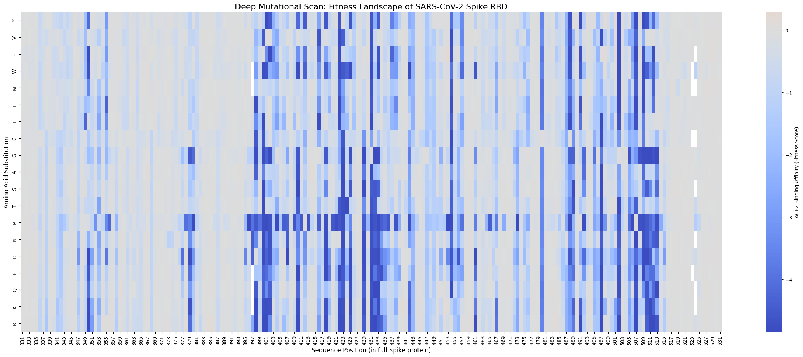
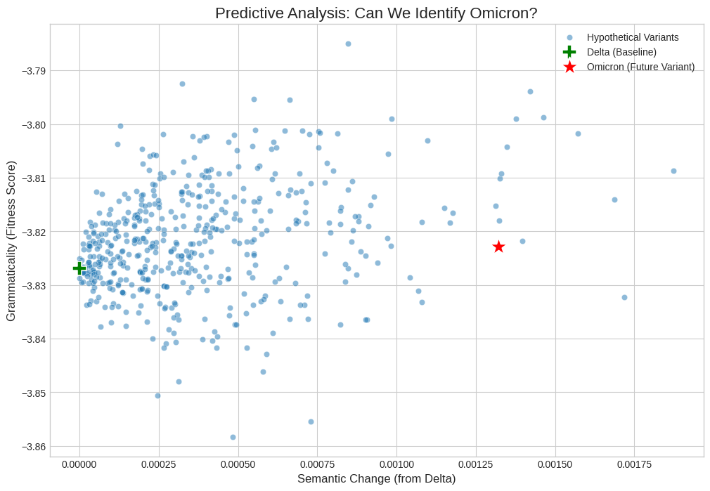

### **Report on the Computational Prediction of Viral Evolution**

#### Introduction

The emergence of new viral variants, exemplified by the SARS-CoV-2 pandemic, has underscored the need for tools that can move beyond surveillance and into the realm of predictive science. To anticipate the trajectory of a pathogen, computational biology offers two powerful and philosophically distinct paradigms: the empirical, high-throughput experimentation of Deep Mutational Scanning (DMS) and the theoretical, sequence-based modeling of protein language models. By examining the strengths and inherent limitations of each, we can understand not only the current state of predictive virology but also a promising path forward for developing forecasting systems.

#### Part 1: Contrasting Methods for Study of the Molecular Evolution of Pathogens

The rapid molecular evolution of viruses like SARS-CoV-2 presents a challenge to public health, demanding tools that anticipate the emergence of new, potentially more dangerous variants. The provided analyses demonstrate a powerful, dual-pronged computational approach to this problem, leveraging both state-of-the-art machine learning and traditional bioinformatics to model the complex fitness landscape of the viral Spike protein. By integrating a "big data" language model with a multi-factor biophysical filter, these methods successfully identify the unique characteristics of a high-consequence variant like Omicron, showcasing a remarkable potential for future viral surveillance.

The first and more novel approach, implemented in the `protein_language_model_analysis.py` script, reframes viral evolution through a linguistic lens, drawing directly from the principles of Hie et al. (Science, 2021). This framework posits that a viable viral sequence must be "grammatical," meaning it adheres to the fundamental biophysical rules that ensure its fitness and stability. Concurrently, to evade the immune system, it must undergo "semantic change," altering its functional or antigenic properties. Using a pre-trained protein language model (ESM-2), this analysis quantifies these two abstract concepts. A computational experiment was designed to test this hypothesis: the Delta variant was established as a baseline "past," and the Omicron variant was treated as a "future" test case. To create a robust control group, 500 hypothetical variants were generated by introducing random mutations into the Delta sequence.

The results of this analysis, visualized in the "Predictive Analysis" scatter plot, are striking. The vast majority of random, hypothetical variants cluster in a tight cloud characterized by low semantic change and fitness scores generally lower than the Delta baseline, confirming that most random mutations are evolutionarily inconsequential or deleterious. In stark contrast, the Omicron variant appears as a dramatic outlier, occupying a unique space with both extremely high semantic change and a grammaticality score even higher than the highly successful Delta variant. This result powerfully demonstrates the model's ability to distinguish a coherent, high-fitness evolutionary leap from a background of random mutational noise. It suggests that, had this tool been available in late 2021, it could have flagged the Omicron sequence as a uniquely concerning threat requiring immediate investigation.

While the language model provides a powerful predictive signal, a complementary approach, detailed in the `evolutionary_data_retrieval.py` script, involves modeling the explicit biophysical and evolutionary constraints that govern the virus. This pipeline integrates multiple layers of biological information to build a more granular and interpretable fitness map. It begins by gathering homologous sequences through a BLAST search, creating a Multiple Sequence Alignment (MSA) to calculate an evolutionary conservation score for each position. It then incorporates structural data by downloading a PDB file, using DSSP to calculate a "Burial Score" based on solvent accessibility. Finally, it uses the BLOSUM62 matrix to score the physicochemical severity of potential mutations.

This multi-factor analysis culminates in the deep mutational scan heatmap of the SARS-CoV-2 Spike RBD. This visualization offers a clear view of the protein's functional constraints. The prevalence of dark blue indicates that most random mutations are deleterious to ACE2 binding, highlighting the protein's finely tuned nature. Certain vertical "cold spots" reveal positions that are functionally indispensable, where almost any change is catastrophic. Conversely, lighter-colored regions show areas more tolerant to mutation, likely forming the structural scaffold rather than the direct binding interface. This heatmap provides insight behind viral fitness, visualizing the specific biophysical rules that the "grammaticality" score of the language model learns implicitly.

 

**Heatmap of the Fitness Landscape of the SARS-CoV-2 Receptor-Binding Domain.** This heatmap which illustrates the fitness landscape of the SARS-CoV-2 Receptor-Binding Domain (RBD) of the Spike protein. This type of visualization, derived from a deep mutational scan, systematically maps the functional consequences of mutations. The x-axis represents each amino acid position within the RBD, while the y-axis lists all possible amino acid substitutions. The color of each cell corresponds to a fitness score, which in this context is ACE2 binding affinity. Darker blue colors indicate mutations that are detrimental to binding, whereas lighter colors signify mutations that are neutral or potentially beneficial. This allows for a comprehensive view of which positions are sensitive to change and which are more tolerant.

 

Despite the striking success of these methods, a critical analysis reveals important limitations, particularly concerning the language model's "semantic change" metric. The model's abstract, high-dimensional embedding space is a "black box," and the semantic change score is a monolithic proxy for an incredibly complex biological reality. In the real world, immune escape is not a single event but a negotiation with a polyclonal antibody response and a diverse T-cell response, as outlined in the provided background text. A mutation might abolish binding for one antibody while having no effect on another; the single scalar value of semantic change cannot capture this nuance. Its utility is therefore overstated if it is interpreted as a direct, mechanistic measure of immune evasion rather than a sophisticated, data-driven measure of functional novelty. Furthermore, the model's accuracy is fundamentally dependent on the breadth and lack of bias in its training data, conflating true antigenic change with sequences that are merely rare or undersampled.

In summary, the analyses conducted demonstrate that computational biology offers two powerful, complementary paradigms for understanding and predicting viral evolution. The first, a traditional biophysical filtering approach, effectively maps the landscape of what is not probable, identifying mutations that are likely to fail due to violation of fundamental evolutionary and structural rules. The second, a modern protein language model, excels at navigating the remaining space of possibility to identify rare variants that are not only viable but also possess a high degree of functional change. While the abstractions used by these models must be interpreted with caution, their practical utility is undeniable. Together, they form a robust hypothesis-generation engine, capable of sifting through a deluge of sequence data to prioritize and focus experimental and public health resources on the variants that pose the greater escape potential from host immunity.

#### Part 2: The Deep Mutational Scanning Approach

The relentless evolution of pathogens like SARS-CoV-2 has transformed virology into a field of predictive science, suggesting methods that can anticipate the trajectory of a global pandemic. At the forefront of this effort are two philosophically approaches for forecasting viral escape: the empirical, high-throughput experimentation of Deep Mutational Scanning (DMS), such as by the lab of Jesse Bloom, and the theoretical, sequence-based modeling exemplified by Hie et al. (Science, 2021). While both methodologies have demonstrated successes, their value and inherent limitations can only be understood through the lens of probability, sampling theory, and the complex co-evolutionary arms race between pathogen and host.

The Deep Mutational Scanning approach provides a direct, empirical map of the viral fitness landscape. By systematically creating a library of every possible amino acid substitution in a protein like the SARS-CoV-2 Spike and testing these variants in a controlled lab environment, DMS measures the real-world biophysical consequences of mutation. This method can answer specific, critical questions: which mutations enhance binding to the ACE2 receptor, and which allow the virus to evade neutralization by a specific antibody or a vaccinated individual's serum? The work from the Bloom lab has been profoundly prescient, generating fitness maps that, long before the emergence of Omicron, had already identified many of its key substitutions as being highly advantageous for both ACE2 binding and antibody escape. DMS, in essence, provides the experimental ground truth, an "answer key" for a specific set of selective pressures.

In contrast, the sequence-based approach of Hie et al. (2021) operates from a more theoretical, information-based perspective. By training a protein language model on the vast evolutionary history of a viral family, this method learns the implicit rules of viral viability and function. It quantifies a mutation's impact along two axes: "grammaticality," a proxy for the biophysical fitness and stability of the protein, and "semantic change," a proxy for the magnitude of its antigenic or functional novelty. Its power lies in its ability to make "zero-shot" predictions without requiring new, resource-intensive lab experiments. By analyzing sequence data alone, it can rapidly flag variants that possess the dangerous combination of high viability and significant antigenic change, a signal that was shown to effectively distinguish major Variants of Concern from a background of less threatening viral noise.

 

**Scatter Plot of Semantic versus Grammatic Change across Viral Variants.** This is a scatter plot of the data generated by a protein language model to analyze viral variants. It assesses variants on two computational metrics relative to a baseline, the Delta variant. Semantic Change on the x-axis: measurement of how different a variant's predicted function or structure is from the Delta variant, based on the model's learned embeddings. Grammaticality on the y-axis: proxy for biological fitness or viability, calculated as the sequence's log-likelihood according to the model. A higher (less negative) score suggests the sequence is more "plausible". It demonstrates that while randomly generated hypothetical variants cluster near the Delta baseline, the Omicron variant is a significant outlier. It possesses both high grammaticality and a large semantic change.

 

The challenge that both methodologies grapple with is the sheer scale of the evolutionary "space of possibilities." The set of all potential mutations a virus can explore is astronomically vast, and the path to a successful new variant is not deterministic but fundamentally probabilistic. For a new clade to emerge, a mutation must first arise by chance, a process governed by the virus's replication rate and its intrinsic error rate. Second, this new sequence must pass the biophysical viability filter; it must be "grammatical" enough to produce a stable, functional protein. Finally, it must confer a selective advantage in the current environment, such as enhanced transmissibility or immune evasion. Both DMS and language models are powerful because they are intelligent forms of sampling this immense space. DMS samples the space experimentally, providing a high-resolution map of a small, well-defined region of the landscape. Language models sample the space statistically, leveraging evolutionary history to identify which regions of the landscape are most likely to be "grammatical" and thus worth exploring.

However, recognizing these methods as forms of sampling also illuminates their profound limitations. The empirical truth provided by DMS is, ultimately, the truth of a simplified system in a laboratory dish. It cannot capture the full complexity of a human host, where a virus confronts a multi-faceted immune response involving not just antibodies but T-cells, interferons, and other innate defenses. The fitness it measures is a proxy, and a mutation that appears highly fit in a simple binding assay may fail in the face of a robust T-cell response. Conversely, the sequence-based models, while powerful in their generality, are limited by their abstraction. The "semantic change" metric is a monolithic value representing a highly specific, polyclonal reality; it cannot distinguish between escape from one antibody versus another. Furthermore, as these models learn from existing data, they risk conflating true antigenic novelty with mere statistical rarity, and their "black box" nature can obscure the precise biophysical mechanisms driving their predictions.

Ultimately, the best form of verification for any predictive model is prospective, real-world validation against the variants that actually emerge and achieve dominance in the human population. The success of both DMS maps and the Hie et al. (2021) model in retrospectively identifying the key mutations of major variants is a powerful testament to their validity. Looking forward, the question of whether host immunity can adapt faster than the virus can mutate is central. This is not a contest where one side overwhelms the other, but rather a dynamic interplay where each shapes the other's evolutionary path. The immense mutational capacity of the pathogen provides the raw material for evolution, but the landscape upon which this evolution occurs is sculpted by host immunity. The broad and robust T-cell response, often targeting more conserved regions of the virus, creates functional "walls" and "barriers" on this landscape, making certain evolutionary pathways prohibitively costly for the virus. Simultaneously, the more focused antibody response creates steep "escape ramps," channeling viral evolution toward specific changes in variable regions like the Spike's Receptor Binding Domain. The most successful predictive models will therefore be those that can integrate these competing forces, using sequence-based models to forecast the general contours of the fitness landscape, and then using targeted DMS experiments to provide high-resolution data on the specific regions of that landscape currently under the most intense selective pressure from the host.

#### Part 3: Critique of the use of Metrics from Language Processing in Molecular Evolution

The Hie et al. (2021) paper on learning the language of viral evolution is an exceptional study, and any critique must be framed as a nuanced analysis of its boundaries rather than a fundamental refutation of its value. The work’s strengths are significant, beginning with its conceptual elegance and novelty. By reframing the complex biological problem of viral escape through the analogy of natural language, the authors showed a class of computational tools from an entirely different field. This approach is supported by empirical validation; the authors perform a state-of-the-art comparison of their model's predictions against experimental fitness data, known escape mutations, and established structural biology, demonstrating remarkable consistency across three distinct and challenging viruses. This rigor gives the method a high degree of practical impact, providing the scientific community with an immediate and actionable tool for monitoring emerging viral variants and identifying regions of concern for vaccine development, representing a benefit over prior methods.

Despite these strengths, a critique reveals inherent limitations in its proposed metrics, particularly the "semantic change" score, whose utility can be overstated. The first issue lies in the "black box" nature of the deep learning model itself. The semantic embedding that underpins the metric is an abstract mathematical construct, not a direct model of antibody-protein interaction energy. While the paper shows that this semantic space correlates with known biological properties like viral subtype, it cannot fully explain which specific biophysical properties the model has learned. This creates a risk of the model identifying statistical artifacts in the sequence data that are not truly representative of antigenicity, potentially leading to false positive predictions where a large change in the embedding space is unrelated to immune recognition.

This abstractness leads to the most critical flaw: the semantic change metric is monolithic and lacks specificity. The model calculates change as a single scalar value—the distance between two vectors—which measures the magnitude of a change but not its character or direction. Real-world antigenicity is not a single property; a virus faces a polyclonal antibody response involving many different antibodies binding to various epitopes. A mutation might completely abolish binding for one antibody but have no effect on another. The semantic change score is incapable of distinguishing between these distinct biological outcomes, reporting only that "a change" has occurred. This is a significant oversimplification of the complex landscape of immune escape and means the metric's utility is overstated if one assumes it can predict escape from a specific therapeutic or antibody. This is further complicated by the model’s conflation of what is "unseen" with what constitutes "escape." Because the model is trained on existing viral sequences, its semantic change metric is fundamentally a measure of novelty. While a clever proxy, this means a mutation in a rare or undersampled lineage could be flagged as having high semantic change even if it has no antigenic consequence.

Furthermore, the "grammaticality" proxy for viral fitness, while strongly correlated, is imperfect. Biological fitness is an incredibly complex property determined by stability, folding kinetics, and myriad interactions that a model based on local sequence context cannot fully capture. As the paper’s own data suggests, most mutations with high semantic change result in low fitness. The model is searching for needles in a haystack, and its fitness predictor is not infallible, meaning it could predict an escape mutant that could never actually survive in the real world. This imperfection makes the authors’ suggestions of generalizing the method to other selective pressures, such as T-cell escape or drug resistance, highly speculative. The "semantics" of these biological problems are governed by entirely different rules, and applying the same metric without careful adaptation and re-validation would be an overstatement of its utility.

In summary, the Hie et al. (2021) paper is a landmark study that successfully bridges the fields of virology and natural language processing. Its introduction of "grammaticality" and "semantic change" as proxies for fitness and antigenic change is a powerful and effective innovation. The critique, however, lies in recognizing the limitations of these proxies. The "semantic change" metric is not a direct measure of antigenicity but rather a data-driven abstraction. Its flaws—its monolithic nature and its black-box dependency on training data—mean its utility becomes overstated when these abstractions are mistaken for direct, mechanistic models of biology. The authors have created an incredibly useful tool for approximating and ranking potential escape mutants at a massive scale, but it is not a perfect predictor and does not eliminate the essential role of experimental validation.

#### Conclusion

The ultimate verification of any predictive model is prospective, real-world validation against the variants that emerge and achieve dominance. The retrospective success of both DMS maps and language models is a testament to their validity, but the path forward requires acknowledging the dynamic interplay of the co-evolutionary arms race. The pathogen's immense mutational capacity provides the raw material for evolution, but the fitness landscape upon which it operates is sculpted by host immunity. The broad T-cell response creates functional "walls" and "barriers" in conserved regions, while the focused antibody response creates steep "escape ramps" in variable regions. The most successful predictive models will therefore be those that integrate these competing forces. A synergistic workflow, using sequence-based models to rapidly survey the vast landscape of possibility and identify regions of interest, followed by targeted DMS experiments to provide high-resolution empirical data on those specific regions, represents the most robust strategy. By combining the speed and breadth of theoretical models with the empirical depth of experimental methods, we can transform predictive virology into a truly indispensable tool for public health.
