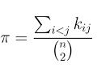

# Proposal: A Quantitative Analysis of SARS-CoV-2 Evolutionary Dynamics Through Spatio-Temporal Patterns of Nucleotide Diversity

[This is a draft of a proposal that serves as a reference for methods to study viral evolution at scale. Please confirm any details here before use in your research study. I will continue to update it as it is of interest to study the dynamics of a virus at its operational scale, both in a geographical and a temporal context, so that generalizations of findings are robust as possible. Much of the literature in this area seems narrower in scope, yet the sequence data is present, so it likely requires the kinds of approaches here with the known limitations related to heterogeneity among data sources and the difficulties in handling "noisy data". A particular area of interest are the frequency and formation of recombinants with a focus on viral variant distributions during their emergence and the corresponding genetic events that lead to their origins.]

## Table of Contents

* 1. Introduction
* 2. Theoretical Framework and Key Concepts

  * 2.1. Nucleotide Diversity (π) and Neutral Theory
  * 2.2. BEAST Software and Phylodynamic Inference
  * 2.3. Ecological Regimes of SARS-CoV-2 Evolution
  * 2.4. Integration of Temporal Sweeps and Spatial Founder Effects
* 3. Research Question and Hypothesis
* 4. Methodology

  * 4.1. Data Source
  * 4.2. Sampling Strategy
  * 4.3. Data Processing Workflow
  * 4.4. Analysis (π calculation and phylodynamics)
* 5. Expected Outcomes and Significance
* 6. Computational Feasibility
* 7. Timeline

## 1. Introduction

The evolutionary trajectory of SARS-CoV-2 is characterized by **dynamic shifts between adaptive regimes**, including gradual adaptation via point mutations, recombination-driven innovation, and antigenic “leaps” from cryptic older lineages.  This process is primarily driven by antagonistic coevolution with host immunity: novel variants acquire immune-escape mutations under selective pressure (Harvey *et al.*, Nature Reviews Microbiology, 2021) and then spread through positive selection (e.g., in Spike RBD) as new strains. Key population-genetic forces shaping these dynamics include:

* **Positive Selection:**  Rapid fixation of advantageous mutations (e.g., in Spike) enables immune evasion and increased transmissibility. When a highly-fit variant emerges, it can trigger a **global selective sweep** that replaces the viral population worldwide (as seen in the rise of Alpha, then Delta, and later the XBB lineage by JN.1).

* **Selective Sweeps and Linked Selection:**  A selective sweep on the largely non-recombining SARS-CoV-2 genome drags along linked sites, purging nearly all pre-existing variation and causing a population-wide collapse in genetic diversity.

* **Purifying Selection:**  Deleterious mutations in constrained genes (e.g., the polymerase) are removed, maintaining essential viral functions. This acts in opposition to positive selection.

* **Genetic Drift and Founder Effects:**  Transmission bottlenecks during geographic spread amplify random drift.  For example, when the virus seeds a new region, only a subset of lineages founds the outbreak (a classical founder effect), reducing diversity.  Consistent with this, comparative studies have observed a *diversity gradient*: diversity tends to be highest in a variant’s region of origin and lower in downstream “sink” locations.

* **Recombination:**  In periods of high diversity with multiple co-circulating lineages, recombination can create novel variant genomes.  A notable example is the XBB recombinant (from two BA.2 lineages) that became globally dominant in late 2022 (Planas *et al.*, Nature Communications, 2024). Recombination has been shown to significantly shape SARS-CoV-2 evolution and fitness, and even momentarily serve as a mechanism for sweeping in new variants.

The net effect of these competing forces – selection, drift, recombination – is captured by a single fundamental metric: **nucleotide diversity (π)**.  By systematically measuring π across time and space, we can quantify the imprint of sweeps, drift, and recombination on the virus’s genetic variation.  Prior analyses have documented that each major variant (e.g. Alpha, Delta, Omicron) corresponded to a sharp global sweep, with diversity collapsing and then re-accumulating.  Conversely, phases like late 2022 saw many Omicron sublineages co-circulating, leading to sustained high π and enabling recombinant forms (XBB) to emerge.  Occasional “antigenic leaps” (e.g. Omicron BA.1 or the recent BA.2.86) appear to arise from long-unsampled lineages, reflecting unobserved evolutionary bursts. These observations suggest that SARS-CoV-2 alternates between sweep-dominated regimes and phases of mosaic diversity.

This proposal seeks to **quantitatively test whether observed π patterns deviate from a neutral expectation**.  Instead of qualitatively describing variant events, we will compute π in balanced spatio-temporal samples and examine its variation.  For example, we expect to see sharp drops in π associated with known sweeps and non-uniform spatial patterns reflecting founder effects, contrary to the uniform diversity predicted by simple neutral models.  Our approach integrates classical population genetics with modern phylodynamics to develop a comprehensive framework for SARS-CoV-2 evolution.

## 2. Theoretical Framework and Key Concepts

### 2.1. Nucleotide Diversity (π) and Neutral Theory

**Nucleotide diversity (π)** is defined as the average number of nucleotide differences per site between two sequences randomly sampled from the population (Nei & Li, Proc Natl Acad Sci USA, 1979).  Formally,

where k(ij) is the per-site difference between sequences \$i\$ and \$j\$.  Under the **Neutral Theory of Molecular Evolution** (Kimura, The Neutral Theory of Molecular Evolution, 1983), π reaches an equilibrium value determined by the product of the effective population size (\$N\_e\$) and the per-site mutation rate (\$\mu\$). For a haploid organism like a virus, the classical formula is

$$
\pi = 2 N_e \mu,
$$

because two lineages coalesce in an average time of \$2N\_e\$ generations and accumulate mutations at rate \$2\mu N\_e\$.  Here, \$N\_e\$ is not the census number of infected hosts but an “effective” count of viral lineages that contribute to future generations, encompassing factors like transmission bottlenecks and superspreading.

**Interpretation of π:**

* A **high π** value indicates substantial genetic polymorphism, as expected when multiple lineages co-circulate under drift or balancing forces.
* A **low π** indicates homogeneity (e.g. after a recent sweep has fixed one lineage).

Under strict neutrality (no selection or demographic change), π would be relatively stable.  Significant departures – such as sharp temporal drops or systematic spatial gradients – signal non-neutral processes (Tajima, Genetics, 1989).  In practice, we will compute π per region and time window.  For instance, a sudden global decrease in π coincident with the rise of a known variant would support the selective sweep hypothesis, whereas a spatial pattern of higher π at the variant’s origin and lower π at distant sites would support serial founder effects.

### 2.2. BEAST Software and Phylodynamic Inference

While our primary focus is on measuring π directly, it is also important to connect π patterns to underlying population dynamics.  **BEAST (Bayesian Evolutionary Analysis by Sampling Trees)** is a leading software package for *phylodynamic inference* (Suchard *et al.*, Virus Evolution, 2018).  BEAST takes time-stamped sequence data (and optional metadata like sampling location) and jointly infers phylogenetic trees along with parameters of evolutionary and demographic models.  In particular, BEAST can estimate changes in effective population size (\$N\_e(t)\$) over time using coalescent-based models (e.g. Bayesian Skyline) and can fit structured or birth–death models to quantify spread and recombination rates.

Critically, BEAST does **not** *compute* π; rather, it *infers* the processes that cause π to change.  For example, BEAST will infer population expansions or contractions (via inferred \$N\_e(t)\$ trajectories) that theoretically underlie observed diversity fluctuations.  In coalescent terms, BEAST uses molecular sequences to reconstruct the genealogy and estimate how rapidly lineages coalesce; a long coalescent time (high inferred \$N\_e\$) corresponds to higher π, whereas a rapid coalescence (low \$N\_e\$) corresponds to reduced π.

**Strengths:** BEAST is explicitly designed for temporally and spatially structured data, which matches the SARS-CoV-2 scenario.  It integrates genomic data with sampling dates and locations to test complex hypotheses (e.g., timing of sweeps or migration between regions). Modern implementations allow coalescent or birth–death models, skyline models for flexible \$N\_e(t)\$, and discrete or continuous trait diffusion to model geographic spread.  This flexibility makes BEAST a powerful tool to interpret how demographic events generate the diversity patterns we measure.

**Limitations:** The principal limitations of BEAST are computational and model-dependent.  Analyses are extremely CPU-intensive, requiring that only subsampled data (e.g. \~hundreds to thousands of genomes) can be analyzed.  Results also depend heavily on the chosen models and priors: if the coalescent or migration model is poorly specified, inferred parameters (and thus their implied effects on π) may be incorrect.  Therefore, BEAST inferences must be validated by extensive sensitivity analyses (testing multiple model forms, priors, and subsamples).  In summary, BEAST is a *statistical inference* tool: it will yield posterior distributions for \$N\_e(t)\$, tree topologies, and migration rates, but it does not output π directly. Instead, we interpret BEAST’s inferred dynamics as the causative factors of our measured diversity.

**Power Analysis:** A specific numerical calculation of sampling power to detect a true event is not presented since the models required for the calculation have not yet been parameterized. A power analysis for this experiment requires, at a minimum, specific numerical values for the following parameters:

1.  For the Selective Sweep Model: The selection coefficient (*s*) of the variant being tested.
2.  For the Demographic Bottleneck Model: The magnitude and duration of the reduction in effective population size.

Without these parameter values, the effect size—the quantitative difference in the expected value of π between the two scenarios—is unknown. It is therefore not possible to calculate the probability of detecting that difference. 

### 2.3. Ecological Regimes of SARS-CoV-2 Evolution

SARS-CoV-2 evolution has alternated among several distinct “regimes” or modes of variation:

* **Gradual Adaptation (Point Mutations):**  Slow accumulation of mutations (e.g. within a clade) that fine-tune viral fitness. This mode produces low-level increases in π over time but no dramatic shifts.

* **Co-circulation/Mosaic Regime:**  Many lineages persist simultaneously (e.g. mid-2022 Omicron sublineages BA.5, BQ.1, XBB, etc.). This maintains a high global π. Such regimes often set the stage for recombination: indeed, the XBB lineage arose by recombination of two co-circulating BA.2-derived strains.  During these mosaic phases, π stays elevated as multiple divergent genotypes co-exist.

* **Selective Sweep Regime:**  A single lineage with a fitness advantage rapidly dominates worldwide. Classic examples include the transitions of Alpha→Delta, Delta→Omicron, and later Omicron XBB→JN.1. Each sweep corresponds to a precipitous drop in π, as one genome template overtakes others. In our data, a sweep regime will appear as a sharp global minimum of π.

* **Antigenic Leap (Deep-Branch Emergence):**  Occasionally, a variant appears from a phylogenetic “long branch,” indicating it evolved in an unsampled reservoir (e.g. in chronically infected hosts or an animal host). Omicron BA.1 is a prime example, arising with \~30 new spike mutations unexplained by gradual transmission chains. BA.2.86 (2023) is another such leap. These events effectively reset diversity by introducing a highly divergent lineage suddenly.

By categorizing sampling windows into these ecological regimes, we can interpret π changes in context.  For instance, during a “mosaic” period we expect sustained π and evidence of recombination breakpoints, whereas in a “sweep” period we expect a crash in π.  Publications have documented these patterns: Wang *et al.* (Frontiers in Microbiology, 2022) found successive sweep phases dividing the pandemic into epochs of low diversity. Tamura *et al.* (Nature Communications, 2023) note that recombination (as in XBB) significantly drove diversity during late 2022. We will annotate our spatio-temporal data with known variant timelines to align π trends with these regimes.

### 2.4. Integration of Temporal Sweeps and Spatial Founder Effects

The most comprehensive view of SARS-CoV-2 population dynamics comes from **integrating temporal and spatial patterns**.  In this framework, a global selective sweep is not an instantaneous global event but the culmination of a local sweep followed by worldwide spread.  For example, a novel variant first emerges and rises to high frequency in one region (driving local π down), then spreads to other regions via repeated founder events. Each “hop” seeds new outbreaks, each with a genetic bottleneck. Comparative studies have shown that as Alpha and Delta spread globally, the viral populations in distant regions converged to near-uniform sequence spectra (Tasaki *et al.*, PLOS One, 2021). In other words, the global sweep was built by successive spatial founder events from the origin, each causing additional diversity loss.

Formally, this suggests a **metapopulation epidemiological model** (coupled regions) linked to a **structured coalescent**.  Under this model, each subpopulation follows an SIR/SEIR dynamic, and migration among subpopulations introduces founder bottlenecks.  Coalescent theory then predicts that the tree of sampled genomes will show deep coalescence during global expansion (high \$N\_e\$ locally) interrupted by rapid coalescence during spread.  A sweep corresponds to one lineage overtaking others (pruning the tree), while founder effects appear as star-like expansions from one region to others.

In practice, we will test this integrated view by examining π in two ways: temporally (before vs. after each known sweep in each region) and spatially (origin vs. sink regions during spread).  We expect, for example, that π in the source region will initially be higher than in newly seeded regions (a signature of founder effects).  Over time, as the variant spreads, local π will also rise due to additional lineages.  These patterns – a dip in π at sweep onset, and a geographic gradient of π during expansion – are predicted by the combined sweep–founder model.  Confirming them in the data will validate that **recurring sweeps and founder events jointly govern SARS-CoV-2 evolution**.

## 3. Research Question and Hypothesis

**Objective:** Test whether global SARS-CoV-2 genetic diversity deviates from neutral expectations in space and time. Specifically, does \$\pi\$ show non-random fluctuations corresponding to selective sweeps and founder events?

* **Null Hypothesis (H₀):** The nucleotide diversity (π) of the global SARS-CoV-2 population is uniform across time and space, with any observed variance attributable to random sampling error under neutrality (Kimura, The Neutral Theory of Molecular Evolution, 1983).

* **Alternative Hypothesis (Hₐ):** The nucleotide diversity (π) exhibits statistically significant, structured variation across time and/or space, reflecting population-dynamic processes.  In particular, π will **decrease** sharply during the rise of highly-fit variants (selective sweeps) and will vary systematically with geographic spread (higher at source, lower at sink), as predicted by the sweep–founder model.

We will formally test these hypotheses by comparing π in balanced spatio-temporal bins to the neutral expectation (e.g. via permutation or simulation under neutrality), and by correlating π with known variant emergence times and locations.

## 4. Methodology

Our approach is to compile a balanced dataset of SARS-CoV-2 genomes stratified by time and region, compute nucleotide diversity in each stratum, and interpret the spatio-temporal patterns using phylogenetic inference.

### 4.1. Data Source

We will use the global, mutation-annotated phylogeny and metadata maintained by the UShER/Nextstrain consortium (Turakhia *et al.*, Nature Genetics, 2021). This continuously-updated repository aggregates high-quality SARS-CoV-2 sequences from GISAID and other public databases (Shu & McCauley, Eurosurveillance, 2017), annotated with collection date and sampling location. It provides a standardized, time-resolved phylogenetic tree covering millions of genomes, from which we can efficiently select subsamples.

### 4.2. Sampling Strategy

For the initial analysis for calculating nucleotide diversity, we will implement the following design.

*  **Clade Selection:** Select a large initial set of clades (e.g., the top 250 or 500 based on `exclusive_count`) to serve as a candidate pool. This pool would then be subjected to a subsequent filtering step to retain only those clades that are active within the 2022–2024 timeframe, thereby mitigating the chance of missing relevant lineages.

*  **Sample Size per Clade:** Select a large initial set of samples per clade (e.g. 1000). This would be implemented as taking the minimum of either 1000 or the total number of available exclusive samples for that clade.

To avoid biases from uneven sequencing effort, we will implement a **stratified random sampling** design.

* **Time window:** We will analyze data from July 2022 through July 2024. This interval spans key regime changes: the late-2022 Omicron recombination era and the global sweep of the JN.1 lineage in 2023.

* **Geographic strata:** We will define 4–6 broad regions with consistently high surveillance (e.g. North America, Western Europe, East Asia, Southern Africa). Each region is treated as a separate stratum.

* **Sampling protocol:** Within each two-week interval and each region, we will randomly sample a fixed number (e.g. \$n=100\$) of genomes from the pool.  This yields a balanced spatio-temporal grid (region \$\times\$ time bin), minimizing confounding by uneven data.  After sampling, we will downsample or augment each bin as needed to ensure all strata have equal representation.

* **Quality control:** We will exclude low-coverage or incomplete sequences, and filter out problematic sites. The remaining alignments in each bin will be aligned using standard tools (e.g. MAFFT) and masked for hypervariable regions.

It is important to note that our analysis will follow a phased, hierarchical approach. The initial phase of this study, for which our primary workflow is designed, will focus on identifying the dominant **global clades** and characterizing their diversity dynamics. This will establish a foundational understanding of which lineages have been most successful on a worldwide scale. A subsequent analytical phase will then address the spatial component of our hypothesis directly. This will involve adapting the sampling framework to stratify data by both defined geographic regions and time windows, enabling a more granular investigation of diversity gradients and the testing of specific hypotheses related to founder effects. This staged methodology ensures methodological clarity and focus at each level of analysis.

### 4.3. Data Processing Workflow

For each spatio-temporal bin, we will extract the aligned sequences and perform the following steps:

1. **Nucleotide Diversity (π) Calculation:** We will compute π (average pairwise differences per site) using established tools. For example, we can use `snp-sites` to convert alignments to variant calls and then compute π with tools like `scikit-allel`.  This yields a time series of π for each region.

2. **Phylogenetic Tree Validation:** We will ensure that the sampled sequences match the UShER phylogeny by pruning the global tree. This allows comparing our diversity measures with global phylogenetic context.

3. **Metadata Assignment:** Each bin will be labeled with the most likely dominant lineage(s) present (e.g. Omicron BA.5, XBB, JN.1) based on Pango lineage calls (Rambaut *et al.*, Nature Microbiology, 2021), to aid interpretation.

### 4.4. Analysis (π calculation and phylodynamics)

Our analysis will proceed in two complementary parts:

* **Diversity Dynamics:** We will plot π over time for each region and the global pooled sample.  We will statistically test whether there are significant deviations from stability.  In particular, we will examine π around known variant emergence dates.  For example, we expect to see π rise or plateau during Omicron co-circulation and then drop sharply as JN.1 sweeps.  We will use permutation tests or bootstrap confidence intervals to assess significance of changes, accounting for sampling variance.

* **Spatial Patterns:** We will compare π across regions for each time slice.  Under H₀, π should be roughly equal everywhere; under Hₐ, regions seeded later should have lower π.  We will apply ANOVA or mixed-effects models to test for systematic regional differences, controlling for sampling dates.

* **BEAST Phylodynamic Inference:** In parallel, we will use BEAST (Suchard *et al.*, 2018) to infer effective population size trajectories and migration rates for selected periods.  For instance, we may build a BEAST skyline model for JN.1 sequences sampled worldwide to estimate when \$N\_e\$ (lineages) contracted (sweep onset).  We will also try a structured coalescent model across two regions to quantify migration rates.  These results will help interpret the π patterns: e.g. a drop in inferred \$N\_e\$ concurrent with a π crash would confirm that reduced lineage coalescence drove diversity loss.

We acknowledge the significant computational constraints of Bayesian inference methods. The large, balanced dataset generated for the primary nucleotide diversity (π) analysis will be too extensive for direct use in BEAST. Therefore, a **secondary, targeted subsampling step** will be performed to create a smaller, maximally informative dataset specifically for the BEAST analysis. This will not be a simple random subsample. Rather, the selection of sequences will be hypothesis-driven. For example, to model the global sweep of the JN.1 lineage, we will curate a dataset composed of its direct predecessor (BA.2.86), early JN.1 samples from its region of origin, and later samples from geographically distinct locations during its expansion phase. This two-tiered sampling strategy leverages the statistical power of the large dataset for robust diversity measurement while enabling focused, mechanistic inference with BEAST on a computationally tractable and scientifically relevant subset.

All computational analyses will be scripted for reproducibility.  We will use Snakemake or Nextflow to pipeline the processing of each bin.  Calculating π on thousands of genomes (via subsampled bins) and running BEAST on tens to hundreds of sequences are computationally intensive but feasible with high-performance compute clusters (see Section 6).

## 5. Expected Outcomes and Significance

This study will yield an empirical, quantitative picture of SARS-CoV-2 genetic diversity dynamics.  Specifically, we expect to observe that **π is not uniform** but shows structured variation:

* **Selective Sweeps:** We anticipate sharp decreases in π coinciding with the rise of new dominant lineages.  For example, as Suratekar *et al.* (Molecular Systems Biology, 2022) reported, the global diversity plunged when Alpha and Delta spread.  We expect to see similar signatures with JN.1’s emergence.

* **Founder Effects:** Spatially, we expect to see diversity gradients.  Regions where a variant first appears (and where multiple introductions accumulate) should have higher π than remote regions initially seeded by few lineages. This pattern – consistent with serial founder events – has been documented in previous variant expansions.

* **Recombination Eras:** In phases where multiple lineages co-exist, such as the late-2022 period characterized by various Omicron subvariants, we expect to observe persistently elevated global nucleotide diversity. The emergence of the XBB recombinant itself is not expected to cause an immediate drop in π. Instead, its addition to the pool of co-circulating lineages should contribute to maintaining a high level of genetic variation. This sustained high π serves as a quantitative signature of a "mosaic" evolutionary regime, which stands in direct contrast to the diversity-purging signature of a selective sweep.

To test this hypothesis directly, we will conduct a post-hoc analysis that partitions the diversity. We will compare the total nucleotide diversity (π_total) in a given time bin against the diversity calculated *within* each major co-circulating lineage (e.g., π_XBB, π_BQ.1). The expected result is that π_total will be significantly higher than the diversity of any individual sub-group, providing quantitative evidence that the high overall diversity was driven by the large genetic distance between these co-circulating lineages.

Validating these patterns will have both theoretical and practical significance.  Theoretically, it will **confirm the integrated model** that SARS-CoV-2 evolution is driven by recurrent sweeps and founder events.  This integrates population-genetics principles (selection and drift) into a coherent framework for pandemics, extending classic neutral theory to a complex viral scenario.  Practically, understanding how π behaves during sweeps vs. co-circulation can aid real-time surveillance: a sudden dip in π in sequencing data could serve as an early warning of an imminent global sweep. In summary, by moving from qualitative narrative to quantitative analysis, this work will provide a deeper, evidence-based understanding of SARS-CoV-2 population dynamics, building on major findings in Science and Nature that have documented variant-associated diversity changes.

## 6. Computational Feasibility

All analyses will be performed on a high-performance computing cluster.  Computing π for \~200 genomes per bin is relatively fast (seconds to minutes per bin using efficient tools).  The main resource demand is running BEAST: even a modest analysis (e.g. 100 sequences) may require \~1–2 days on a multi-core node.  However, since our focus is on diversity measurement, we will use BEAST selectively (e.g. 2–3 models for key intervals) and leverage existing Beast2 optimizations (e.g. BEASTling for streamlined config, BEAGLE library for speed).  We estimate a total of \~1,000 CPU-hours for the BEAST inferences, which is feasible on an academic cluster.

We have expertise in bioinformatics workflow (using Snakemake) to automate the data processing.  We will use mature libraries (scikit-allel in Python, BEAST2 with XML config) and version control to ensure reproducibility.  Data storage needs (sequence alignments and trees) are on the order of tens of gigabytes, well within available resources.

## 7. Timeline

We outline the project milestones over 12 months:

| Month | Task                                                                                       |
| ----- | ------------------------------------------------------------------------------------------ |
| 1–2   | Data acquisition and QC; finalize stratified sampling design; set up processing pipeline.  |
| 3–4   | Compute π for initial dataset; perform preliminary diversity analyses.                     |
| 5–6   | Phylodynamic model setup; run BEAST analyses for key periods (e.g. Omicron, JN.1).         |
| 7–8   | Statistical testing of hypotheses (π changes vs. neutral expectation; spatial variance).   |
| 9–10  | Integrate results; compare π trends with inferred \$N\_e(t)\$ and known variant timelines. |
| 11    | Draft manuscript and figures; solicit feedback from co-authors.                            |
| 12    | Revise and finalize report; prepare code and data for publication.                         |

By month 4 we expect to have the core π dataset and basic observations.  BEAST runs and final analyses will be complete by month 8, allowing several months for synthesis and writing.

This research will elucidate the fundamental processes driving SARS-CoV-2 evolution, leveraging cutting-edge datasets and methods.  Its findings will inform future surveillance strategies and improve our understanding of viral adaptation in a pandemic context.

## 8. Credits

Jules AI, Gemini Pro (Google), and ChatGPT (OpenAI) helped develop this proposal on extending knowledge on the ecological dynamics at scale of a virus.
